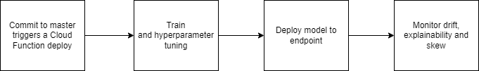
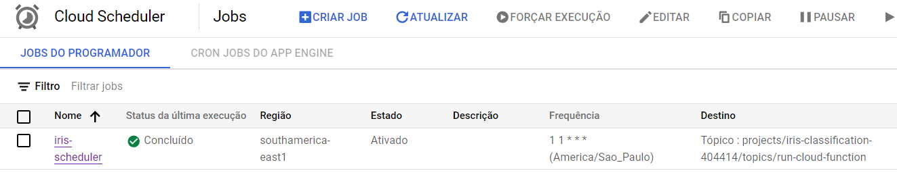
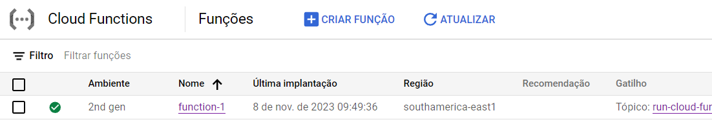

[](https://github.com/rodrigohaddad/iris-classification-ml/actions/workflows/deploy-app.yml)

# Iris Classification ML

Iris Classification ML is a machine learning pipeline built on 
Google Cloud Platform. The pipeline uses Vertex AI SDK to train,
create an endpoint and monitor the classification results of a Neural Network 
applied to the Iris dataset.

## Table of Contents

- [Requirements](#requirements)
- [Installation](#installation)
- [Tests](#tests)
- [Configuration](#configuration)
- [Usage](#usage)

## Requirements

To fully use this pipeline, a Google Cloud account with billing active is necessary.

- A Google Cloud project
- Python 3.9+
- Google Cloud SDK (gcloud)

## Installation

1. Clone the repository:

   ```bash
   git clone https://github.com/rodrigohaddad/iris-classification-ml.git
   ```

2. Change to the project directory:

   ```bash
   cd iris-classification-ml
   ```
   
3. Create a virtual environment:
    ```bash
   virtualenv venv
   ```
   
4. Activate the virtual environment (on Windows, use venv\Scripts\activate):
    ```bash
   source venv/bin/activate
   ```

5. Install the required Python packages:

   ```bash
   pip install -r requirements.txt
   ```
   
6. Configure yor `.env` by using `env` as reference.

## Tests
Execute unit tests:
   ```bash
   python -m unittest
   ```

## Configuration

### Environment Variables

- `GOOGLE_APPLICATION_CREDENTIALS`: Path to your Google Cloud service account key JSON file.

### Configuration File

You can create a configuration file (`config.yaml`, `config.json`, etc.) for custom settings.

```yaml
# Example config.yaml
project_id: your-project-id
region: us-central1
```

### Authentication

Ensure you are authenticated with the Google Cloud SDK using `gcloud auth application-default login`.

## Local usage

For a complete local pipeline execution, simply run:

```bash
python main.py
```

By executing `main.py` you will be running the following steps using the Vertex AI pipelines and SDK. From which:
* **Train**: packages model code as Docker image or package to execute training in a remote cloud machine
 with pre-established entry hyperparameters or with hyperparameter tuning.
* **Deploy endpoint**: deploys your previously trained model to an online endpoint. Configure
replicas according to traffic.
* **Monitoring**: creates a job to monitor endpoint. Supports skew and drift 
monitoring. It is also able to provide explanations.

## Automatic pipeline deployment

Commits to master trigger:
- Unit tests.
- Deployment of model package to Cloud Storage.
- Deployment of the pipeline contained in `src` to a Cloud Function.

After model package is deployed to Storage and pipeline code is deployed to a CF, you
may want to trigger the pipeline manually by forcing the execution of the Cloud Scheduler.
If you choose to wait, next pipeline run will take place on the chosen cron time.




Cloud Scheduler is set up by using cron notation `* * * * *` to send messages to Pub/Sub and trigger the ML pipeline execution:



Then, the pipeline is triggered by the message and execution starts.




## Inference results

Currently, there are two ways of applying the model to your test dataset. Load the model and apply input to the trained model:
```python
import tensorflow as tf
import numpy as np

model = tf.saved_model.load(PATH_SAVED_MODEL)
r = model(
        np.array([
    [5.1, 3.5, 1.4, 0.2]
], dtype=np.float32)
)
```

Or, use `gcloud` to send internal GCP `json` requests to Vertex AI endpoint:
```bash
%%bash
gcloud ai endpoints predict $ENDPOINT_RESOURCENAME \
    --region=$REGION \
    --json-request=test_req.json
```

